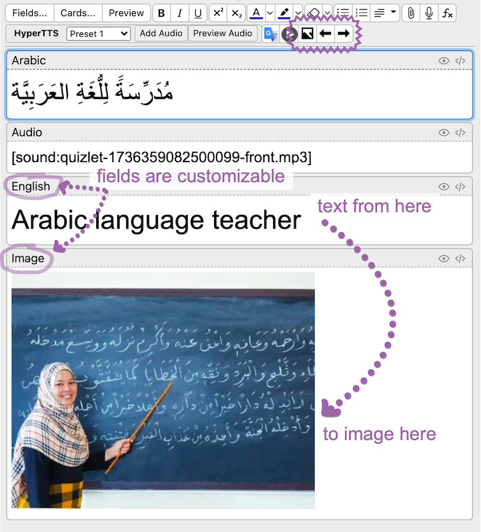
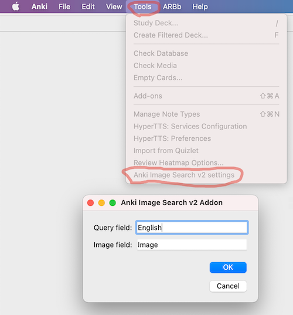

# Anki Image Search v2 Addon
Basically scraps Yandex Images Search and places them on your card.
This only works for Anki 2.1.54+

Forked from https://ankiweb.net/shared/info/885589449, https://github.com/haoxuany/anki_image_search

## Installation

You can now install this addon by simply copying the add-on code `432495333` into Anki (under Tools → Add-ons → Get Add-ons). You no longer need to download anything manually!

More details here: https://ankiweb.net/shared/info/432495333

## How
On the card editor (from either the "Add" or "Browse" dialog), there are three buttons added on the upper right portion of the editor: **Search Image**, **Previous Image** and **Next Image**.

Basically just type in your search query in the field with name "English" in the card, and use those buttons. The image will be inserted/updated in the field "Image".

Also you can change field names in settings:

Yandex Image Search provide good results for English or Russian queries, other languages have not been tested.

You can track the project on [github](https://github.com/nerevar/anki_image_search_v2).

## License

None of this would be possible without Yandex Images. Even though technically I'm scrapping Yandex Images unofficial API which I found on [this github repo](https://github.com/rauschmerscen/yandex-pictures/blob/5a36786d88dbbd30cda123aab525039216c316ff/src/utils/create-url.js#L22).

The icons are provided by [Open Iconic](https://useiconic.com/open). Open Iconic is licensed under MIT.

This project is under [GPLv2](./LICENSE).

## Why
The main reason I did that, is to make learning other languages more comfortable for me (and others) because original [Image Search](https://ankiweb.net/shared/info/885589449) addon, which uses Google Images Search, looked abandoned and didn't work.
And, of course, because of 2 free evennings :)

Also, I agree with original author of addon: he writes, that he knows just how important it is to be able to point at pictures and recall words without going through a translation phase. He got annoyed doing it by hand at around 20 cards.

